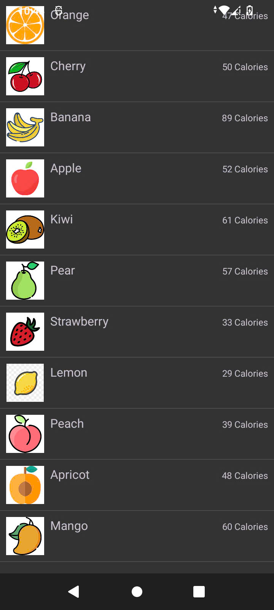

# AndroidLab-Week5
Bài tập tuần 5 môn Thực hành Lập trình ứng dụng trên thiết bị di động.

- **Bài 5.1:** CustomListViewExample - Danh sách phiên bản Android.
- **Bài 5.2:** ListViewCustomLayout - Danh sách trái cây với thông tin calo.

Result

